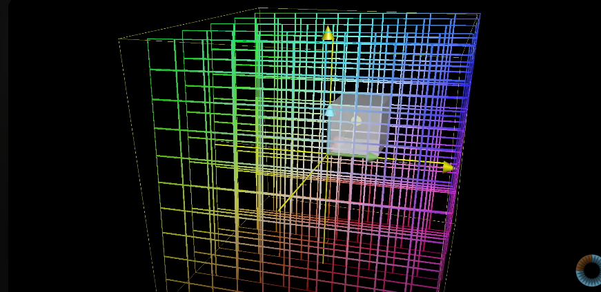
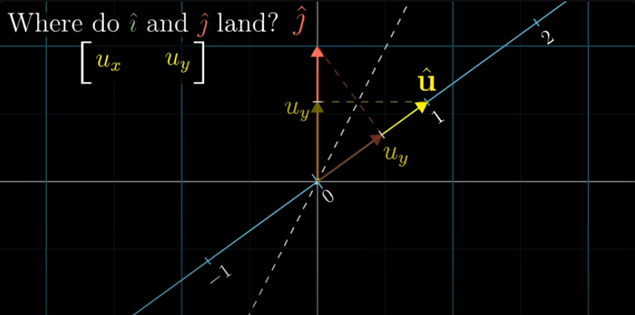

# Essence of linear algebra
## chapter 1:

everytriplet of number gives one unique vector and every vector gives unique triplet of numbers
This is true for any dimension

### vector addition
move along the direction of the first vector and then along the direction of the second, the resultant is the sum of the vector

### vector multiplication =
a * V where V is a vector
stretches if a > 1
squish it down if 0 < a < 1
also reverses if a < 0 

## chapter 2
### Linear combinations, span, and basis vectors 
i hat and j hat are the basis vectors of the xy coordinate system

so, we can choose different basis vector and build a completely new coordinate system 

in linear combination of two vectors, if we fix one scalar and change the other, the resultant vector traces a line

if we change both scalars, the we get every possible vector in the space
(exception - both vectors are lined up or they are zero)

*span of two vectors*

for collection of vectors, we think of them as points to avoid crowdedness

**span of two vectors**

**span of two vectors which line up**

## span of vectors in 3D
a flat sheet cutting through the origin is the span of two vectors in 3D 

(tip: 1st vector scaling gives 1 line, 2nd vector scaling gives another line, so we get a sheet)

for span of three vectors in 3D:
 we get 3 vectors, so 3 lines and thus we can access each point of the 3D space

 **if each vector add another dimension to the span, they are termed as linearly independent vectors**

 _Technical definition of basis:_
The basis of a vector space is a set of linearly independent vectors that span the full space

## chapter 3
### Linear transformations and matrices

what are linear transformations?
-> for a transformation to be linear all lines must remain lines 
and the origin must be at place

the below example looks like a linear transformation but actually it isnt because the diagonal gets curved

## after transformation:
note the new coordinates of i hat and j hat(basis vector)
now for the transformed vector coordinates, multiply new i hat and j hat coordinates with the original x, y coordinates

## chapter 4 
### Matrix multiplication as composition
 composition - rotation then shear is also a new _linear transformation_ 

 

first apply the effect on the right(here rotation cuz rotation is carried out first) then the left one (here shear)

so matrix multiplication represents applying one transformation after other
M1M2 != M2M1 i.e order matters

## chapter 5
###  Three-dimensional linear transformations

so, the multipliction of two matrices can be inferred as the right being the first transformation applied, and the left being the second transformation being applied 

## chapter 6
### The determinant

what happens to one grid after transformation happens to any of the other grid 

so, the area will also be scaled by the same amount 
the factor by which the area changes is called the "determinant" of that transformation 

negative  determinant means ->
the orientation has reversed
like if i hat was to the right of j hat previously, then after reversal of orientation i hat would be to the left of j hat

eg - 
    

    in 2D, transformations determine how much area gets scaled and in 3D, transformations determine how much *volume* gets scaled

    before scaling:

    after scaling volume becomes zero: 

    To know if there has happened inverse transformation in 3D, take i hat on your "Right hand" middle finger, j hat on your index finger and k hat on your thumb,
    now, after the transformation if you need to use your left hand to get k hat on your thumb , then there is an inverse transformation

    determinant of a 3D matrix 

## chapter 7 
### Inverse matrices, column space and null space

looking for a vector x which on applying transformation A lands on V

If you do transformation A and then A^-1 then its like doing nothingk 
The transformation that does nothing is called the identity transformation

rank terminology:
-if output of a transformation is a line, then rank = 1
-it is a plane, rank = 2
-3D space , rank = 3
**rank = no. of dimensions in the output of a transformation**

in case of a 2*2 matrix rank 2 means we have a non-zero determinant and we havent collapsed
but in case of 3*3 matrix rank2 means we have collapsed from a volume to a plane , (but the collapsing is not as much as in rank2{line})

full space => rank of input space == rank after transformation
learnt- inverse matrices, column space, rank, null space, kernel

## chapter 8
### Nonsquare matrices as transformations between dimensions 
Transformation from 2d to 3D

transformation from 2d to 3d-

The place where all the vectors land is a 2D plane slicing through the origin of 3D space

so, a 3*2 matrix has geometric interpretation of the mapping two dimensions to three dimensions since the two colums indicate that the input space has two basis vectors and the three rows indicate that the landing spot for each of those basis vectors is described with three seperate coordinates 
In the below image, the colums indicate that we are starting in a space that has three basis vectors(i.e 3D space)  
and the two rows indicate that the landing spot for each of those three basis vectors is described with only two coordinates(so landing in 2D)

## chapter 9  
### Dot products and duality 
dot pdts are very useful to understand projections
geometric interpretion of dot product

**numbers to 2D vectors and 2D vectors to numbers**
squishing the 2D plane into a number line will squish the vector to numbers

{The number where i hat lands when its projected onto the numberline is same as where u hat lands when uts projected on the x axis(since both are unit vectors so by symmetry we can say this). So, projection of i hat on numberline = Ux}
anytime we have one of any linear transformations whose output space is the number line, there's going to be some unique vector v corresponding to that transformation, in the sense that applying the transformation is the same  thing as taking a dot product with that vector

Duality <=> natural but surprising correspondence
dot products are transformation

## chapter 10
### Cross products