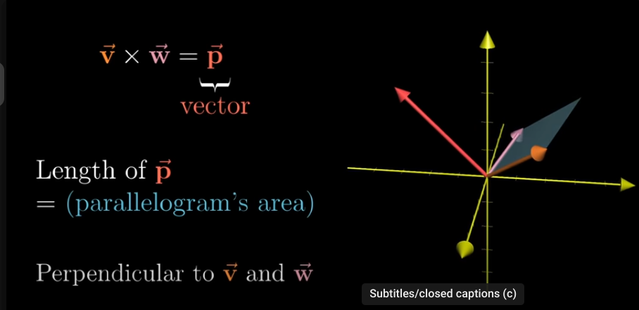
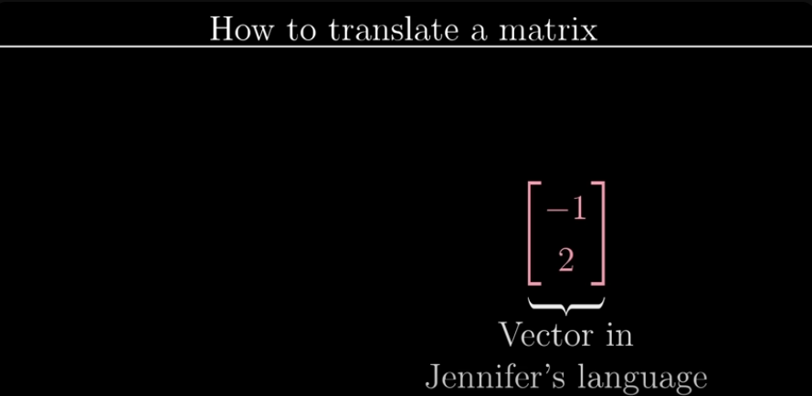
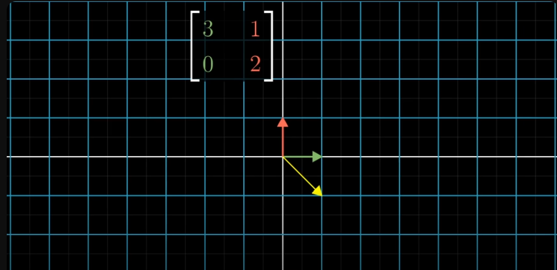
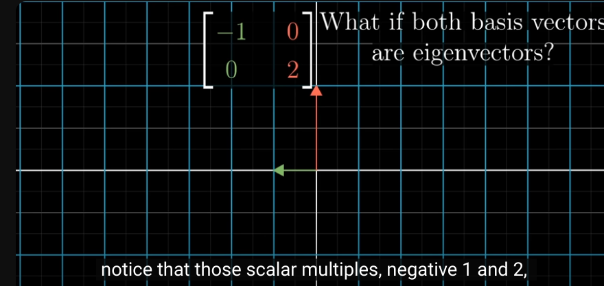
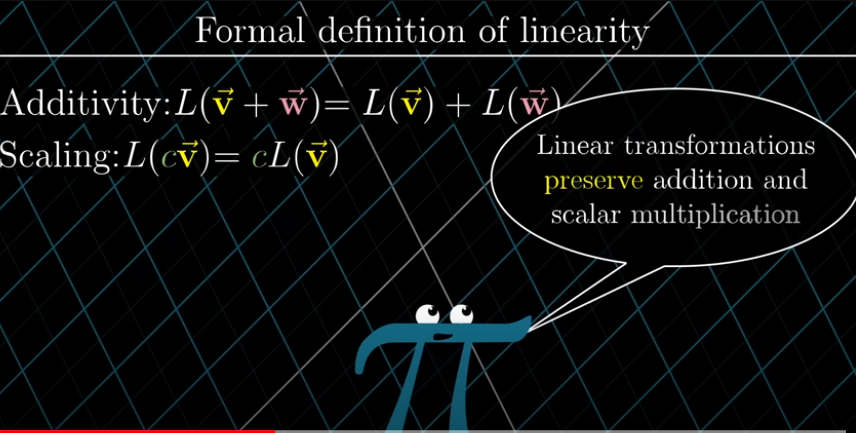

# Essence of linear algebra
## chapter 1:

everytriplet of number gives one unique vector and every vector gives unique triplet of numbers
This is true for any dimension

### vector addition
move along the direction of the first vector and then along the direction of the second, the resultant is the sum of the vector

### vector multiplication =
a * V where V is a vector
stretches if a > 1
squish it down if 0 < a < 1
also reverses if a < 0 

## chapter 2
### Linear combinations, span, and basis vectors 
i hat and j hat are the basis vectors of the xy coordinate system

so, we can choose different basis vector and build a completely new coordinate system 

in linear combination of two vectors, if we fix one scalar and change the other, the resultant vector traces a line

if we change both scalars, the we get every possible vector in the space
(exception - both vectors are lined up or they are zero)

*span of two vectors*

for collection of vectors, we think of them as points to avoid crowdedness

**span of two vectors**

**span of two vectors which line up**

## span of vectors in 3D
a flat sheet cutting through the origin is the span of two vectors in 3D 

(tip: 1st vector scaling gives 1 line, 2nd vector scaling gives another line, so we get a sheet)

for span of three vectors in 3D:
 we get 3 vectors, so 3 lines and thus we can access each point of the 3D space

 **if each vector add another dimension to the span, they are termed as linearly independent vectors**

 _Technical definition of basis:_
The basis of a vector space is a set of linearly independent vectors that span the full space

## chapter 3
### Linear transformations and matrices

what are linear transformations?
-> for a transformation to be linear all lines must remain lines 
and the origin must be at place

the below example looks like a linear transformation but actually it isnt because the diagonal gets curved

## after transformation:
note the new coordinates of i hat and j hat(basis vector)
now for the transformed vector coordinates, multiply new i hat and j hat coordinates with the original x, y coordinates

## chapter 4 
### Matrix multiplication as composition
 composition - rotation then shear is also a new _linear transformation_ 

 

first apply the effect on the right(here rotation cuz rotation is carried out first) then the left one (here shear)

so matrix multiplication represents applying one transformation after other
M1M2 != M2M1 i.e order matters

## chapter 5
###  Three-dimensional linear transformations

so, the multipliction of two matrices can be inferred as the right being the first transformation applied, and the left being the second transformation being applied 

## chapter 6
### The determinant

what happens to one grid after transformation happens to any of the other grid 

so, the area will also be scaled by the same amount 
the factor by which the area changes is called the "determinant" of that transformation 

negative  determinant means ->
the orientation has reversed
like if i hat was to the right of j hat previously, then after reversal of orientation i hat would be to the left of j hat

eg - 
    

    in 2D, transformations determine how much area gets scaled and in 3D, transformations determine how much *volume* gets scaled

    before scaling:

    after scaling volume becomes zero: 

    To know if there has happened inverse transformation in 3D, take i hat on your "Right hand" middle finger, j hat on your index finger and k hat on your thumb,
    now, after the transformation if you need to use your left hand to get k hat on your thumb , then there is an inverse transformation

    determinant of a 3D matrix 

## chapter 7 
### Inverse matrices, column space and null space

looking for a vector x which on applying transformation A lands on V

If you do transformation A and then A^-1 then its like doing nothingk 
The transformation that does nothing is called the identity transformation

rank terminology:
-if output of a transformation is a line, then rank = 1
-it is a plane, rank = 2
-3D space , rank = 3
**rank = no. of dimensions in the output of a transformation**

in case of a 2*2 matrix rank 2 means we have a non-zero determinant and we havent collapsed
but in case of 3*3 matrix rank2 means we have collapsed from a volume to a plane , (but the collapsing is not as much as in rank2{line})

full space => rank of input space == rank after transformation
learnt- inverse matrices, column space, rank, null space, kernel

## chapter 8
### Nonsquare matrices as transformations between dimensions 
Transformation from 2d to 3D

transformation from 2d to 3d-

The place where all the vectors land is a 2D plane slicing through the origin of 3D space

so, a 3*2 matrix has geometric interpretation of the mapping two dimensions to three dimensions since the two colums indicate that the input space has two basis vectors and the three rows indicate that the landing spot for each of those basis vectors is described with three seperate coordinates 
In the below assets/image, the colums indicate that we are starting in a space that has three basis vectors(i.e 3D space)  
and the two rows indicate that the landing spot for each of those three basis vectors is described with only two coordinates(so landing in 2D)

## chapter 9  
### Dot products and duality 
dot pdts are very useful to understand projections
geometric interpretion of dot product

**numbers to 2D vectors and 2D vectors to numbers**
squishing the 2D plane into a number line will squish the vector to numbers

{The number where i hat lands when its projected onto the numberline is same as where u hat lands when uts projected on the x axis(since both are unit vectors so by symmetry we can say this). So, projection of i hat on numberline = Ux}
anytime we have one of any linear transformations whose output space is the number line, there's going to be some unique vector v corresponding to that transformation, in the sense that applying the transformation is the same  thing as taking a dot product with that vector

Duality <=> natural but surprising correspondence
-Applying a transformation is the same as taking as dot product with that vector

## chapter 10
### Cross products
-Area of parallelogram =  cross product of the two matrices that form the sides of the parallelogram
-use the right hand thumb rule to know the direction of the area 
Mathematical Interpretation(trick)-

## chapter 11
### Cross products in the light of linear transformations

what is vector p?
p is something that when dot product with x, y, z gives the same result as the result of det of v, w with x,y,z

geometric interpretation of dot product-

geometric interpretation of cross product

but this is also same as dot product with vector x, y, z and vector p with length of p equal to area of parallelogram 

so, this is the geometrical interpretation of the trick

## chapter 13
### change of basis
[-1  
  2] in  two different basis

jenifers coordinate system:

depeding on the choice of basis vectors, the spacing between the grid lines and the choice of axes change although origin is same for any choice of basis vectors
 
How e translate between coordinate systems? 
[-1 
  2] in jenifer's cord system
 
-in our cord system i.e with i hat and j hat

so, a matrix whose columns represents jenifers basis vectors can be thought of as a transformation that moves our basis vectors i hat and j hat to jenifers basis vectors 
like if jenifer says [1 0] , [0 1] then in i hat and j hat it means [2 1], [1,-1]  
how to go from our system to jenifer's system?
Take the inverse of the matrix that translates jenifers language to ours 

so to see what [3 2] of our language looks in jenifers language, multiply [3 2] by the inverse of the basis matrix of jenifers

### summary

90 degree rotation of space in i hat and j hat - 

how will jenifer get the same 90 degree acw rotation transformation in her cord system?
First thought is to translate the rotation matrix of i hat and j hat directly into jenifers language using b1 and b2 as discussed earlier
But this is totally wrong as those columns represent where i hat and j hat go and not where jenifers basis vector would land, so simply transforming of coordinates wont do 
The matrix what jenifer wants should represent where her basis vector land
so, steps are :
start with a vector in jenifers language

Translate it to our language

see where this would land in our transformation(i.e shift of 90 degree ACW)

apply inverse change of basis to see where the vector would land in her language

so , the transformation in her language for any vector v in her language is =

if [1 2] is a vector in jenifers coord system, then [-1 1] is the 90 degree shifted vector in jenifers system

the middle matrix represents a transformation

 
**A^-1 M A = transformation M but from the perspective of new basis vector A**
next chapter: why we care about different coord systems?

## chapter 14 - eigenvectors and eigenvalues
After a transformation is applied, for the span of a vector, the vector may not necessarily lie on its span

but in some special vectors, they do remain on their span . The only effect of the transformation is that it squishes or stretches
eg i hat in this case. the span of i is the x axis : 
    Before transformation:
     
    after transformation:(there is just a stretch by a factor of 3) 
    Any other vector on the x axis follows the same
    
    The same is for a diagonal in this transformation
    
    These special vectors are called as eigen vectors
    The factor by which it gets stretched or squished is called as eigenvalue
    
    If the vector gets flipped over its own span then eigen value = negative

  
In 3D rotation, an eigen vector(a vector that remains on its own span) for that rotation would be the "axis of that rotation"

The eigen value = 1 cuz rotation doesn't squish or stretch anything  
Computing:

Here, v is the eigen vector and lambda is the eigen value 
The matrix vector multiplication of A and v is same as scaling v by a factor is lambda

Now, product of a matrix with a non zero vector v is zero only when the det of the matrix is zero 
This means that the transformation associated with the matrix squishes the space into a lower dimension
 
Choose the value of lambda for which the det gets to zero

so, for lambda = 1, there is a vector v for which the (A-lamda.I). v = 0   
Computation of eigen value and vector corresponding to it: 
get the eigen values

The vector v is the span of all the vectors in the direction x = -y

Note : A 2D transformation might not necesarrily have eigen vectors 
eg. Rotating by 90 degree acw
The values of lambda come out to be imaginary, this indicates that there are no eigen vectors as well
  
for the case of shear, the x axis remains in place  
The transformation matrix for shear is 
[ 1 1
  0 1]  
on solving we get

NOTE: A single eigen value can have more that a line full of eigen vectors 
eg, A matrix that scales everything by 2. Here eigen value = 2

every Vector in the plane gets to be an eigenvector with that eigen value

**What if both basis vectors are eigenvectors**

The eigen values of i hat and j hat (here -1 and 2)
lie in the diagonal and every other entry is zero
 
This is diagonal matrix 
A way to interpret this that in a diagonal matrix, all the diagonal entries are the eigen values and the basis vectors are the eigen vectors
 
Advantages: 
The 100th power of a diagonal matrix is :

The 100th power of a non diagonal matrix is very tough

  
But its rare to have basis vectors as eigen vectors 
**so, if we have multiple eigen vectors enough so that we can span the whole space, then we can change the cord system so that these eigen vectors are our basis vectors** 

The transformation done with the eigen vectors as the basis will result into a diagonal matrix

A set of basis vectors which are also eigenvectors is called eigen basis

 
So, to calculate the 100th power of the transformation matrix, first convert it to a diagonal matrix, get the 100th power and then transform it back into the original.
Thus the complex task as 100th power calculation is simplified 
However, this is possible only when we have enough eigen vectors.
1 eigen vector span would not be enough

## chapter 16 - Abstract vector spaces 

Determinant and eigen vectors don't care about the coordinate system 
What is a vector?
 
A vector is an arrow pointing in space, or it is a list of numbers.  
But more precisely, a vector is like a function 
 
L denotes transformation:

 

generally:

The roles that these basis functions will do is the same as i hat, j hat, k hat and so on in the world of vectors as arrows  
How matrix vector multiplication is similar to derivatives?

The matrix is constructed using the derivative of each basis function like:

--------

Axioms =
 
So, vectors are something which follow these rules
